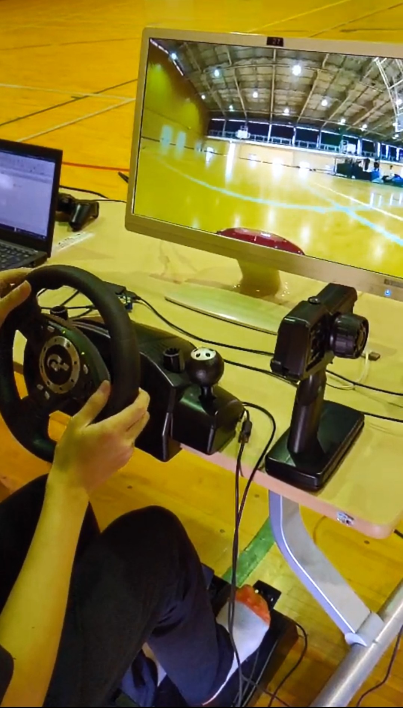

# LIDARの活用方法について
<!--
_class: lead
_paginate: false
_header: ""
-->

## 発表構成
<!--
header:
-->
1. 自己紹介
2. 動機
3. 研究内容
4. システムの説明

## 自己紹介
<!--
header: ""
-->
- 髙橋 尚太郎
- 明石高専 専攻科
機械・電子システム工学専攻
- 卒業研究テーマ：
RCカー遠隔運転システムの開発
運転免許を持っていなくても
実機の操作ができる

## 動機・目的
<!--
header: ""
-->
- 卒業研究：遠隔運転システムの開発
→ 自動運転へ応用 → 北陽電機を知る
- インターンシップに参加
→ LIDARを使った模型台車の制御
- **RCカー手動・自動運転の引継ぎシステムの開発に応用したい**
- **実際に製品を使って開発することで製品の機能を深く知りたい**

## 研究内容 1/2

- 遠隔型自動運転における運転引継ぎに関する研究
- 遠隔型自動運転：遠隔地に設置した操作卓からモニター越しで操作 → 自動運転機能の異常時等の対応 (交通システム)
- 自動運転がシステムの責任で行われるようにするため
運転免許未所持者に対し実用実験を行う必要
→ 遠隔型自動運転には法律上普通自動車免許と法定の訓練が必要
→ **RCカーのシステムで運転免許未所持者の運転技能の解析を行う**

## 研究計画
  - 工学基礎研究 1年間 (~ 2023年3月)
  - 専攻科特別研究 1年間 (~ 2024年3月)

## システムの説明

## 動作

## 実装構成(現在)

## 実装構成(将来)