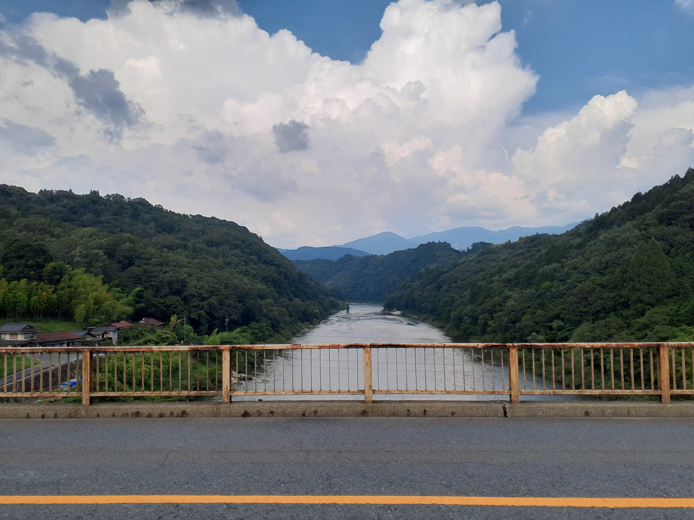
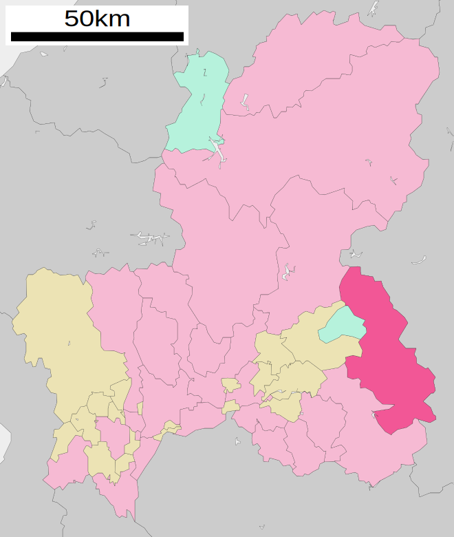
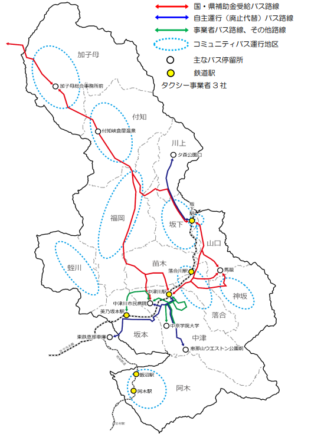
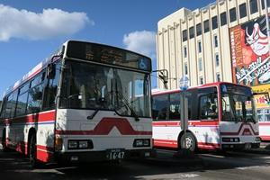
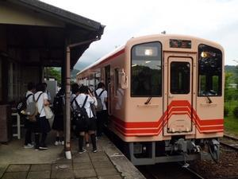
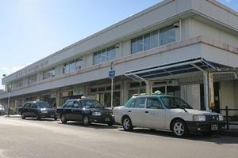
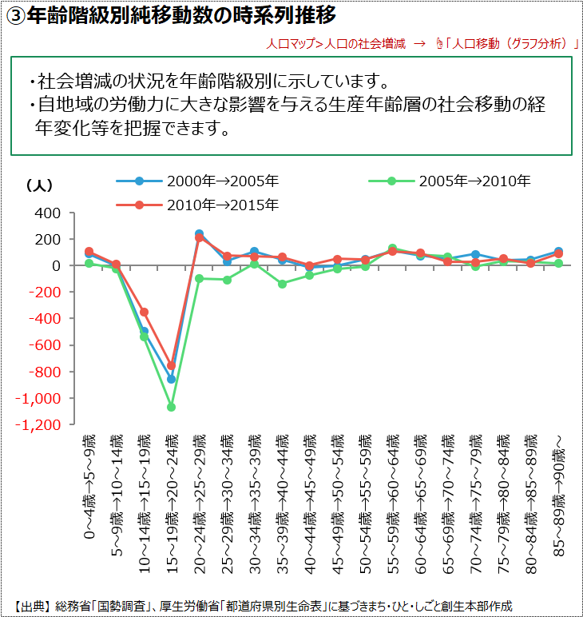
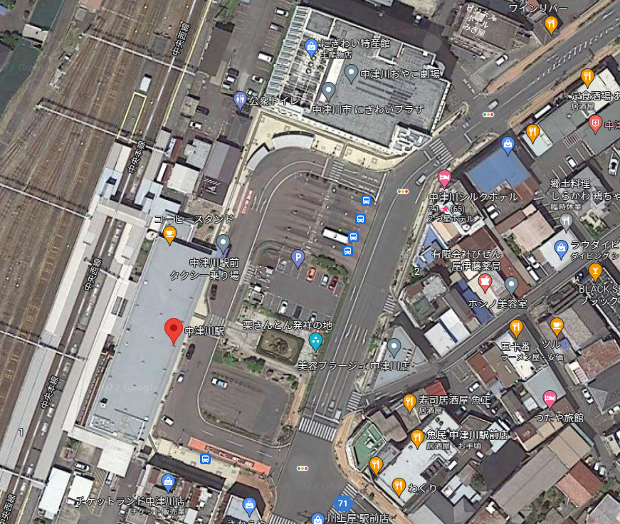

# 地方自治体の交通政策と人口特性 ~中津川市を例に~
ME2208 髙橋尚太郎
<!--
_class: lead
_paginate: false
_header: ""
-->

## 発表構成
- はじめに
- 中津川市の交通政策
- 中津川市の人口特性
- 課題と解決方法
- 総評

## はじめに
- 中津川市？
- なぜ？
- ここで取り扱う内容
    中津川市の交通政策
    中津川市の人口特性
    調査結果を基に総評

## 中津川市
- 岐阜県中津川市

図の引用元：[wikipedia](https://commons.wikimedia.org/w/index.php?curid=111569863による)

# 中津川市の交通政策
<!--
_class: lead
_header: ""
-->

## 概要
<!--
header: 中津川市の交通政策
-->
- 地域公共交通は学生の通学や**運転免許を持たない方**、 **来訪者の移動手段**として重要な役割を果たす。
→中津川市での移動は自家用車が主という前提で、 **完全に依存している**と明記  (高校生は自動車で送り迎え) (徒歩5分の距離もクルマを使う)

- 利用しやすい地域公共交通を実現するために 「中津川市地域公共交通網形成計画」制定　(2018年3月)

## 中津川市の交通網

- 鉄道(JR中央本線、明知鉄道)
- 路線バス(北恵那バス,濃飛バス)
- タクシー
- コミュニティバス

図の引用元： [中津川市HP](https://www.city.nakatsugawa.lg.jp/material/files/group/15/20220201_teiju_kotu_keikaku.pdf)

## 公共交通機関の外観
左から、北恵那バス、明知鉄道、タクシー

図の引用元：[中津川市地域公共交通計画](https://www.city.nakatsugawa.lg.jp/soshikikarasagasu/teijusuishinka/3/3/873.html)

## 中津川市地域公共交通計画
以下3つが目的 (主に**経営**の面に関して)

- 定住化を支える地域公共交通
→定住率が低い(自動車社会)
- 観光と利用促進
→観光客のための公共交通確保
- 運転手不足解消
→運転手の高齢化、人材確保

# 中津川市の人口特性
<!--
_class: lead
_header: ""
-->
## 人流
<!--
header: 中津川市の人口特性
-->
<!--
転入から転出を引く
-->
- 若年層の定住率の低さ
→高校生から遠方への 　通学・通勤が普通
- どこへ転出、流出？
→主に恵那市、名古屋市

# 問題とその解決手段
<!--
_class: lead
_header: ""
-->

## 問題
<!--
header: "問題の解決手段"
-->
- 自動車社会
- 分かりにくい公共交通システム
  バスターミナル

## 解決手段
- バスターミナルの整備については触れられていない。
- 高校生のバス通学支援(バス通学費補助金)
定期券の購入費の補助
- バス乗り継ぎの円滑化
- タクシー利用の推進

# 総評
<!--
_class: lead
_header: ""
-->

## 問題の解決手段に関して
<!--
header: "総評"
-->
- 解決の方向性：→交通事業の経営のための建前
”移動手段をクルマに頼ってばっかりじゃなくて 既存の公共交通機関をもっと使おう”
- 観光客もっと増やそう...　高校生バス使って...
- **都市計画から改善するという話に到達していない**
- 都市計画というレベルで考えるのはこれから先
→そのためには、**自動車依存からの脱却**が重要
- リニアの駅ができる予定(2027年)→どう影響するか？

## 最後に
- クルマの利用が増える→人が移動しやすくなる→都市の空地が増える→人口が減る→郊外から都市部へ人が流入→公共交通の衰退
**この流れがきれいに当てはまる**
- 実際に現地の人と話をした内容の1つ1つが、事実につながる