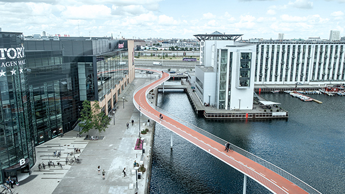
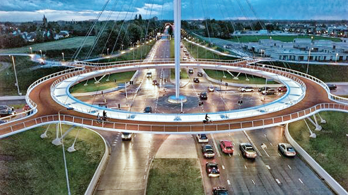

# 欧州の自転車都市化
### ~1990年代以降~
#### ME2208 髙橋尚太郎
<!--
_class: lead
_paginate: false
_header: ""
-->

## はじめに
- ここで扱う内容
  1. ヨーロッパの交通政策の展開
  2. 自転車都市化
  3. コペンハーゲン指標

# 1. ヨーロッパの交通政策の展開
<!--
_class: lead
_header: ""
-->

## 概要
<!--
header: "ヨーロッパの交通政策の展開"
-->
- 1970年代
  - "自動車" 対 "歩行者"
  - 都心部への車の規制
  - 歩行者空間の形成
- 1980 ~ 1990年代
  - トラムの導入
  - 都心内部ー都心部 日常的な交通手段確保

# 2. 自転車都市化
<!--
_class: lead
_header: ""
-->

## 自動車依存型→歩行者・自転車優先へ
<!--
header: "自転車都市化"
-->
- 目的
  - 都市の低炭素化
  - 中心市街地の活性化
  - 市民の健康増進
- **自転車の交通手段としての位置付けを明確化**

## でも実施当初は欧州内で温度差が...
- 実施当初は自転車化の方針が明確でなかった
- 全体の水準を上げるために **国レベルでの自転車政策を立案**
  →日本にはない
- 具体的な数値目標
  - ドイツの国家自転車計画2012 → [国家自転車計画2020](https://www.bmvi.de/SharedDocs/DE/Anlage/StV/nationaler-radverkehrsplan-3-0.pdf?__blob=publicationFile)
  2020年に全交通の15%を自転車にする (都市域8%→13% 地方部11%→16%)

## Cykelslangen
<!--
_header: ""
_footer: ""
-->

[link](http://plusonelane.tokyo/worldcase/)
## Hovenring
<!--
_header: ""
_footer: ""
-->
[link](http://plusonelane.tokyo/worldcase/)

# 3. コペンハーゲン指標
<!--
_class: lead
_header: ""
-->

## 概要
<!--
header: "コペンハーゲン指標"
-->
- 自転車都市化の実現状況を評価する指標
- コペンハーゲン・デザイン会社が作成
- 13の項目で、0 ~ 4の得点が与えられる

## 評価項目

| 1.街路景観  | 2.文化的評価 | 3.意欲的取り組み | 4.特別評価 |
|:------:|:----------------:|:-----------:|:---------------:|
| 自転車インフラ | 性別の自転車利用割合(特に女性) | 自転車利用の奨励  | ボーナス |
| 自転車施設 | 交通量に占める自転車の割合の増加 | 政治(政治家)       |           |
| 交通の落ち着き | 安全指標 | 共用自転車         |           |
|  | 自転車に対する意識           | 都市計画     |           |
|  | 貨物自転車        |      |            |
|各4点の平均|各4点の平均|各4点の平均|

## 上位3都市(2019年)

| 国 | 1.街路景観  | 2.文化的評価 | 3.意欲的取り組み | 4.特別評価 |
|:-----------:|:------:|:----------------:|:-----------:|:---------------:|
|コペンハーゲン| 4.0 | 3.8 | 4.0 | |
|アムステルダム| 3.7 | 3.8 | 3.8 |
|ユトレヒト(オランダ)| 3.7 | 3.8 | 3.8         |

- 日本(東京)は16位 (街路景観：2.5 文化的評価：2.7 意欲的取り組み：1.9)

[Copenhagenize Index 2019](https://copenhagenizeindex.eu/)

## まとめ
- 欧州では自転車都市化によって脱自動車が進んでいる
- 欧州内で国レベルの政策を確立することで 自転車化の方針を確立した
- コペンハーゲン指標で自転車社会の浸透を評価

- 日本の課題
  - 自転車交通計画を政策的に確立する方法の模索
  - 徒歩と自転車を都市交通のメインとする明確な政策と目標設定
  - クルマ社会の日本に自転車が浸透するのか？ → DMV

## 
<!--
_header: ""
_footer: ""
-->
