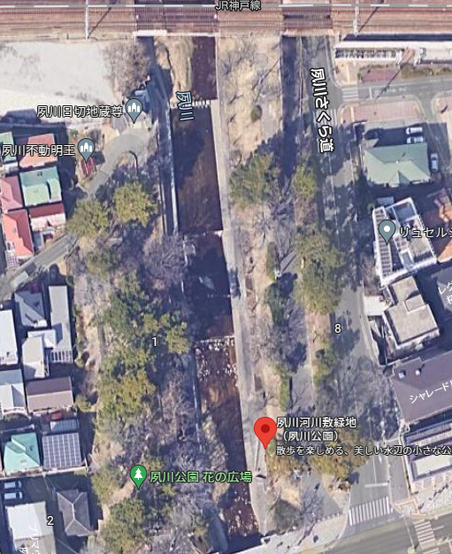

# 神戸市の河川沿い帯状緑地計画
### ~夙川との比較~
<!--
_class: lead
_paginate: false
_header: ""
-->

## はじめに
- 帯状緑地？
- 公園道路(公園街路)？
- ここで扱う内容
  1. 帯状緑地計画の 歴史的背景
  2. 河川沿い空間の比較 (夙川と六甲山麓河川)
  3. 総評

# 1. 帯状緑地計画の歴史的背景
<!--
_class: lead
_header: ""
-->

## 阪神大水害の影響
<!--
header: "帯状緑地計画の歴史的背景"
-->
- 1938年 7月3日 ~ 7月7日
- 総雨量 400 mm ~ 600 mmの豪雨
 
- 神戸市：死者**616**名 家屋流出等**5054**戸
  - 河道を暗渠化して公園を設置
- 西宮市：死者**9**名 家屋流出等**4**戸
  - 前年に竣工した夙川公園が防災上機能

## 神戸市の対策
- 河川とその周辺の幅員増加を提案
- 帯状緑地の提案
   - 平常時：市民の保健休養と都市美観の形成
   - 河川氾濫時：水害の緩和
- 公園道路の提案
  - 自転車、歩行者の通行機能を持つ高幅員の緑地帯

# 2. 現在の河川沿い空間の比較 (夙川と六甲山麓河川)
<!--
_class: lead
_header: ""
-->

## 河川沿いの幅員構成
<!--
header: "現在の河川沿い空間の比較(夙川と六甲山麓河川)"
-->

| 河川名  | 河川沿い空間 平均総幅員[m] | 平均筋数[本] | 一筋当たり 平均幅員[m] |
|------|----------------:|-----------:|---------------:|
| 住吉川  | 52.7           | 12.7      | 4.1           |
| 石屋川  | 43.5           | 7         | 6.2           |
| 都賀川  | 74.3           | 9         | 8.3           |
| 青谷川  | 36.5           | 7         | 5.2           |
| 生田川  | 98.6           | 12.5      | 7.9           |
| 宇治川  | 47.4           | 5.7       | 8.3           |
| 新湊川  | 51.9           | 6.5       | 8             |
| 妙法寺川 | 94.8           | 14.5      | 6.5           |
| 夙川   | 69.5           | 5.7       | 12.2          |

## 住吉川
- 平均総幅員 52.7 m
- 河川敷両岸と両岸の堤内地に 車道と歩道
- 分割が多く一筋が狭い 4.1 m
- 帯状緑地計画決定が未実施
  - 公園がない

## 生田川
- 平均総幅員 98.6 m
- 道路、河川、緑道、歩道など 多くの空間に分割
- 分割が多く一筋が狭い 7.9 m

## 夙川
- 平均総幅員 69.5 m
- 分割が少なく一筋が広い12.2 m
- 幅員に占める公園の割合が高い

## 比較結果
- 西宮市：一筋にゆとりのある河川沿い空間 洪水敷としての公園

  - 河川敷と公園の高低差が低 → 緩傾斜堤防の役割
- 神戸市：河川幅員の細分化、親水性：低

# 3. 総評
<!--
_class: lead
_header: ""
-->

## 神戸と西宮の都市計画の違い
<!--
header: "総評"
-->
- 神戸市：河川・道路は**各個別に機能を最大化**
  - 河川は**治水の安全のみを追求**
  - 道路は**自動車交通を円滑に**
  - 公園は河川と道路を差し引いたところ
- 西宮市：「公園街路」**はじめから公園と道路は一体**

## 神戸と西宮の都市設計の違い

&nbsp; &ensp;  &emsp; &emsp; &emsp; 

## まとめ
- 阪神大水害を受けて
神戸市は帯状緑地を計画
- 神戸の河川沿い空間は**個々の機能面を重視**するため 細分化され独立した設計
- 夙川の河川沿い空間は**公園と道路が一体の**ゆとりある設計
 
- 神戸の河川も夙川を参考にすると...
  - 河川沿い交通の機能面をどう考慮するか?