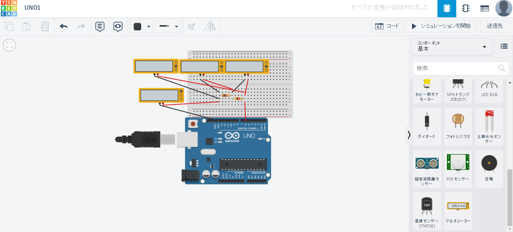
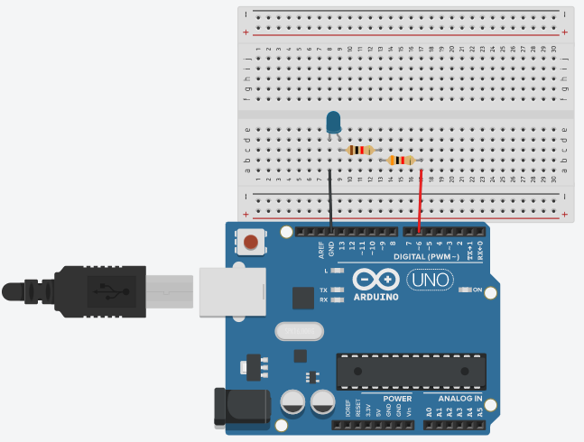
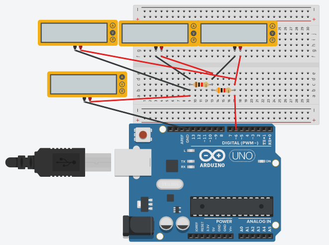
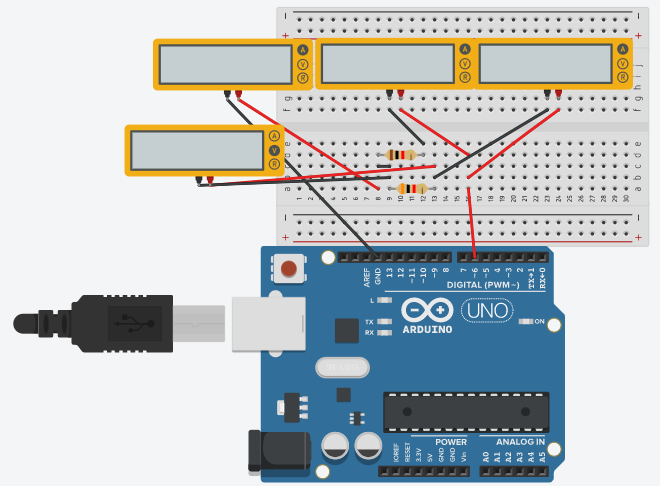
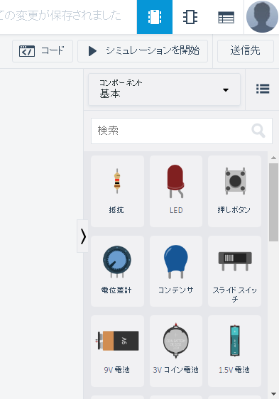
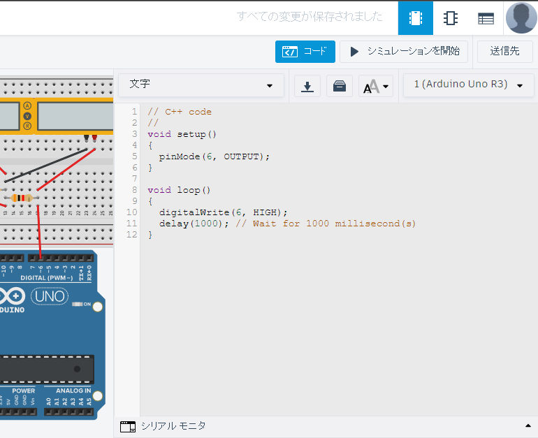
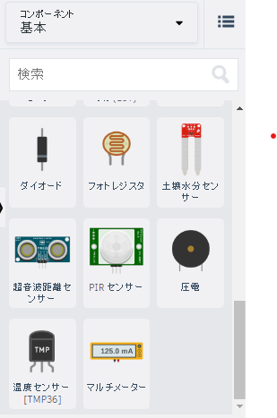
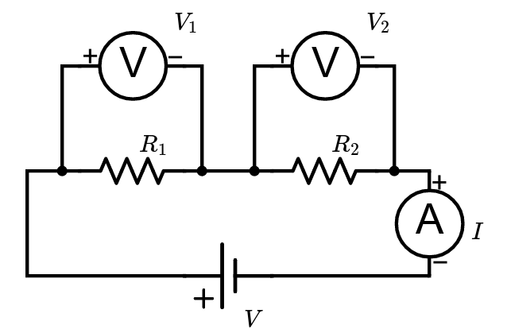
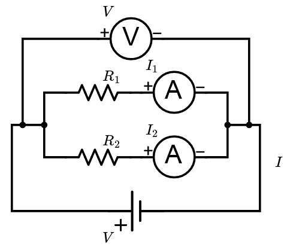

<!-- 
_class: lead
_paginate: false
_header: " "
-->

### Tinkercadを使ってみよう

明石高専
電気情報工学科
2023/06/07


---


<!-- 
class: main
footer: 2023-06-07
_header: TinkerCADとは
-->

- **3Dモデリング**$^1$を作成するためのWebアプリケーション
  - 立体パーツを自由に組み合わせてオリジナルの造形物を作ることができる
  - ブラウザ上で無料で使用できる

- **電気回路**・**マイコンプログラム**を作ることもできる

<div align="center">
    
</div>

> 1: 3Dプリンターで作るものの設計図を作成したり、CGアニメーションの作成などに用いられる、立体的なデータを作成する作業

---
<!-- _header: 作成物 -->

抵抗の直列・並列接続を知ろう

<div class="split">
  <div class="split-item split-left">
    <div class="split-left__inner">

1. LED点滅回路
2. 電圧測定用回路(直列回路)
3. 電流測定用回路(並列回路)

**＊オームの法則**

1. 回路を作る
2. プログラムを作る
3. 実行する
4. 手計算と比べる

  </div>
  </div>
  <div class="split-item split-right">
    <div class="split-right__inner">
      <div style="text-align: center">
      
      
      
      </div>
    </div>
  </div>
</div>

---
<!-- _header: オームの法則 -->

<div class="split">
  <div class="split-item split-left">
    <div class="split-left__inner">


  </div>
  </div>
  <div class="split-item split-right">
    <div class="split-right__inner">
      <div style="text-align: center">

電流(回路を流れる電気): <br>$I$ [**A**]
電圧(回路に電流を流そうとするはたらき): $V$ [**V**]
電気抵抗(電流の流れにくさを表す量): <br>$R$[$\Omega$]

$$ V=IR $$

<br>
<div style="text-align: center;">
「<b>電流</b>は負荷の両端の<b>電圧に比例</b>し負荷の<b>抵抗に反比例</b>する」
</div>
      </div>
    </div>
  </div>
</div>

---
<!-- _header: LED点滅回路 -->
<div class="split">
  <div class="split-item split-left">
  回路図
    <div class="split-left__inner">
          
    </div>
  </div>
  <div class="split-item split-right">
  部品の選定
    <div class="split-right__inner">
      <div style="text-align: center">
      
  </div>
  </div>
  </div>
</div>

---
<!-- _header: プログラム -->

<div class="split">
  <div class="split-item split-left">
  <div class="split-left__inner">

  

  </div>
  </div>
  <div class="split-item split-right">
    <div class="split-right__inner">

```C++
// C++ code
//
void setup()
{
  pinMode(6, OUTPUT);
}

void loop()
{
  digitalWrite(6, HIGH);
  delay(1000); // Wait for 1000 millisecond(s)
  digitalWrite(6, LOW);
  delay(1000);
}
```
  </div>
  </div>
</div>

---
<!-- _header: 電圧測定用回路(直列回路) -->
<div class="split">
  <div class="split-item split-left">
  回路図
    <div class="split-left__inner">
          
    </div>
  </div>
  <div class="split-item split-right">
  部品の選定
    <div class="split-right__inner">
      <div style="text-align: center">
      
  </div>
  </div>
  </div>
</div>

---
<!-- _header: 電流計と電圧計 -->

<div class="split">
  <div class="split-item split-left">
  配置方法
    <div class="split-left__inner">
    </div>
  </div>
  <div class="split-item split-right">
  回路図
    <div class="split-right__inner">
      <div style="text-align: center">
  </div>
  </div>
  </div>
</div>

---

<!-- _header: プログラム -->

<div class="split">
  <div class="split-item split-left">
  <div class="split-left__inner" style="width:45%">

```C++
// C++ code
//
void setup()
{
  pinMode(6, OUTPUT);
}

void loop()
{
  digitalWrite(6, HIGH);
  delay(1000); // Wait for 1000 millisecond(s)
  digitalWrite(6, LOW);
  delay(1000);
}
```

  </div>
  </div>
  <div class="split-item split-right">
    <div class="split-right__inner">

```C++
// C++ code
//
void setup()
{
  pinMode(6, OUTPUT);
}

void loop()
{
  digitalWrite(6, HIGH);
  delay(1000); // Wait for 1000 millisecond(s)
}
```
  </div>
  </div>
</div>

---
<!-- _header: 電圧の理論値と実測値の比較 -->

<div class="split">
  <div class="split-item split-left">
    <div class="split-left__inner">

  

  </div>
  </div>
  <div class="split-item split-right">
    <div class="split-right__inner">
      <div style="text-align: center">

測定電圧: $V_1, V_2$ [**V**]
電気抵抗: $R_1, R_2$ [$\Omega$]

$V_1=IR_1, V_2=IR_2$
$V=V_1+V_2 = R_1I + R_2I$
$= (R_1+R_2)I$

  </div>
  </div>
  </div>
</div>

---
<!-- _header: 電流測定用回路(並列回路) -->
<div class="split">
  <div class="split-item split-left">
  回路図
    <div class="split-left__inner">
          
    </div>
  </div>
  <div class="split-item split-right">
  部品の選定
    <div class="split-right__inner">
      <div style="text-align: center">
      
  </div>
  </div>
  </div>
</div>

※プログラムは直列の時と同じ

---
<!-- _header: 電流の実測値と理論値の比較 -->

<div class="split">
  <div class="split-item split-left">
    <div class="split-left__inner">

  

  </div>
  </div>
  <div class="split-item split-right">
    <div class="split-right__inner">
      <div style="text-align: center">

測定電流: $I_1, I_2$ [**A**]
電気抵抗: $R_1, R_2$ [$\Omega$]

$I_1=\frac{V}{R_1}, I_2=\frac{V}{R_2}$
$I=I_1+I_2 = \frac{V}{R_1} + \frac{V}{R_2}$
$= \left( \frac{1}{R_1}+\frac{1}{R_2}\right) V$

  </div>
  </div>
  </div>
</div>