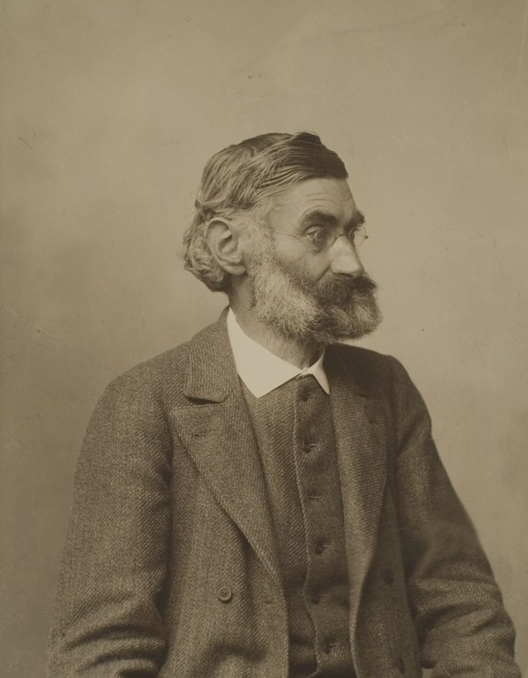
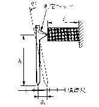
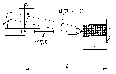
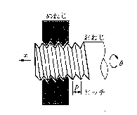
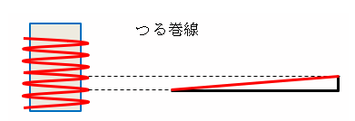
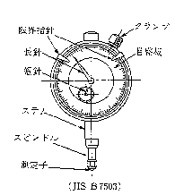
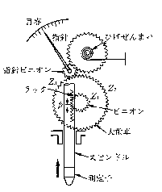
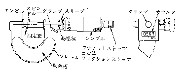

# 機械式センサ 機械的拡大
ME2208 髙橋尚太郎
<!--
_class: lead
_paginate: false
_header: ""
-->

## 発表構成
- はじめに
- 基本原理(3つ)
- 測定機器への応用例

## はじめに
- センサって何？
- センサで大事な事？
- ここで取り扱う内容
    機械的拡大=センサの機能を機械的に拡大させる方法
    測量誤差を減らす工夫について

# 基本原理
<!--
_class: lead
_header: ""
-->

## 歯車による拡大
<!--
header: 基本原理
-->
原軸歯車の歯数、回転数：$Z_1$, $N_1$
従軸歯車の歯数、回転数：$Z_2$, $N_2$
$$\frac{N_2}{N_1}=\frac{Z_1}{Z_2}\tag{1}$$

## アッベの原理

直接測定する場合、 測定対象物と目盛りの位置関係が大事

→測定誤差を軽減するために 　測定機器に施す工夫(精度1~2桁)

- **測定対象物と目盛りが同軸上にない**
- **測定対象物と目盛りが同軸上にある**

エルンスト・アッベ (*1840~1905*)
引用元：[wikipedia](https://ja.wikipedia.org/wiki/%E3%82%A8%E3%83%AB%E3%83%B3%E3%82%B9%E3%83%88%E3%83%BB%E3%82%A2%E3%83%83%E3%83%99)

## 測定対象物と目盛りが 同軸上にない場合

測定ヘッドが測定方向に対して 垂直な場合、 測定ヘッドの傾き $\theta$ による 幾何学的誤差 $\delta_a$

$$\delta_a=h\tan\theta\cong h\theta \tag{2}$$

## 測定対象物と目盛りが同軸上にある場合
<!--
_footer: ""
-->
測定ヘッドが測定方向に対して 同一直線上である場合、 測定ヘッドの傾き $\theta$ による 幾何学的誤差 $\delta_b$
$$
\begin{eqnarray*}
\delta_b &=& (L-l)(1-\cos{\theta)}\\
&\cong& \frac{L-l}{2}\theta^{2} \tag{3}
\end{eqnarray*}
$$
引用元：教科書 p.108

## 実例
ドラえもんの身長を計る

図の引用元：[quora](https://jp.quora.com/%E3%83%89%E3%83%A9%E3%81%88%E3%82%82%E3%82%93%E3%81%AE%E5%8E%9F%E4%BD%9C%E3%81%A8%E3%82%A2%E3%83%8B%E3%83%A1%E3%81%AB%E3%81%8A%E3%81%91%E3%82%8B%E7%9B%B8%E9%81%95%E7%82%B9%E3%81%AB%E3%81%AF%E5%85%B7%E4%BD%93)

## 測定例1

## 測定誤差の計算
測定ヘッドが測定方向に垂直 
測定ヘッドの傾き $\theta$ による 幾何学的誤差 $\delta_a$

$$\delta_a=h\tan\theta\cong h\theta$$

## 測定例2

## 測定誤差の計算
測定ヘッドが測定方向と 同一直線上 
測定ヘッドの傾き $\theta$ による 幾何学的誤差 $\delta_b$
$$
\begin{eqnarray*}
\delta_b &=& (L-l)(1-\cos{\theta)}\\
&\cong& \frac{L-l}{2}\theta^{2}
\end{eqnarray*}
$$

## ねじによる拡大
ねじの移動量 $x$ と回転角 $\theta$ の関係
$$\theta = \frac{2\pi}{p}x\tag{2}$$
$p$ はねじのピッチ
- 補足：$\frac{\theta}{2\pi}=\frac{x}{p}$ を変形
(1周に対する角度比, ピッチ比)
図の引用元：教科書 p.109

## 2条ねじ
- さっきまでは1条ねじの話、リード$=$ピッチ($L=p$)
- リード：1回転で進む距離
- 2本のつる巻き線なので、 リードは1条ねじの2倍$L=2p$
- $n$ 条ねじは、$L=np$

図の引用元： [ものづくりウェブ](https://d-engineer.com/kikaiyouso/youto.html)

# 測定機器への応用例
<!--
_class: lead
_header: ""
-->

## ダイヤルゲージ
<!--
header: 測定機器への応用例
-->
- 歯車を用いた比較測長器
- スピンドルの**直線運動**を ピニオンの**回転運動**に変換
- アッベの原理に基づいて 作られていない。

図の引用元：教科書 p.109

## ダイヤルゲージ原理
- スピンドルの ラック(ピッチ $p$)が ピニオン(歯数 $Z_1$)と 噛み合う
- $Z_2$から$Z_3$に 回転が拡大して伝えられる ($N_2<N_3$) **歯車による拡大**

図の引用元：教科書 p.109

## 原理続き
ダイヤルゲージの目量(目盛りに対応する測定量の大きさ) $s$
$$s=\frac{pZ_1}{M(Z_2/Z_3)} \tag{3}$$
$M$ は目盛り板の目盛り数
- ひげぜんまいによりスピンドルが戻る方向にトルクを作用し、 歯車のバックラッシを除いている。
- 歯車の製作誤差、軸受の遊びなどのため精度(確度)はよくない。

## ノギス
- 対象の厚さ、径などを測定
- 本尺とスライドする副尺
- $\frac{5}{100}$ mm 単位までの精密な長さの測定が可能
- 目盛りと測定位置が離れているので、アッベの原理に従っていない。
文章引用元： [キーエンス測定器ナビ](https://www.keyence.co.jp/ss/products/measure-sys/measurement-selection/basic/abbe-principle.jsp)

## マイクロメータ
- スピンドルとアンビルの間に被測定物を挟んで測定
- 測定方向と測定ヘッド (スピンドル)が同一直線上→**アッベの原理**を満たす

- $x\propto\theta$ より、 $\theta$ から $x$ を導出可能  → **ねじによる拡大**  
図の引用元：教科書 p.110

## 最後に

#### アッベの原理と工作機械について
- 直交座標型工作機械：加工点や測定点を、測長ユニット・駆動ユニットの上に配置することが困難→**アッベの原理を満たせない**
→出力点の位置決め精度が誤差の影響を受けやすかった。
- 空間3自由度パラレルメカニズムを用いた三次元座標測定器の研究
  最も測定誤差が小さくなる

引用元：大岩孝彰,玉木雅人, 「6自由度パラレルメカニズムにおけるアッベの原理に関する研究」, 日本機械学会論文集 C編, vol. 69, no. 678, pp. 472–477, 2003
